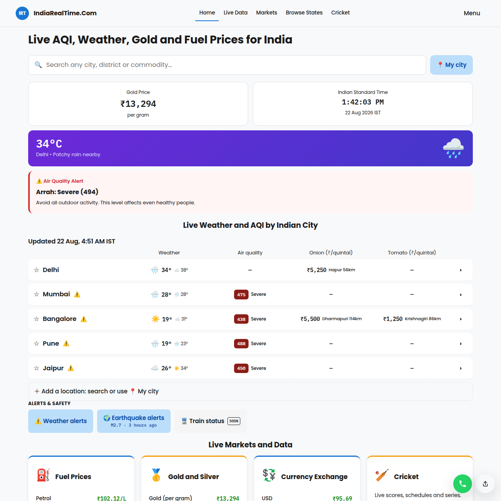
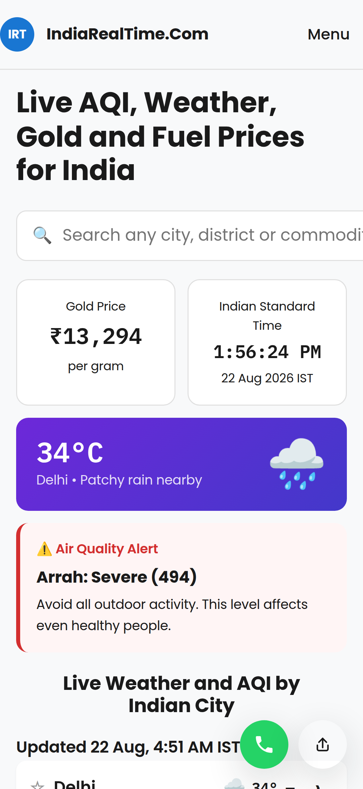

# IndiaRealTime - ଇଣ୍ଡିଆ ରିଅଲ୍ ଟାଇମ୍ | ଲାଇଭ୍ ମଣ୍ଡି ଦର, ଇନ୍ଧନ ଦର, AQI, ପାଣିପାଗ ଚେତାବନୀ ଏବଂ କ୍ରିକେଟ୍ ସ୍କୋର

[](https://deepwiki.com/padmarajnidagundi/indiarealtime-com)
[](LICENSE)
[](https://github.com/padmarajnidagundi/indiarealtime-com/stargazers)
[](https://github.com/padmarajnidagundi/indiarealtime-com/issues)
[](API/)

🌐 **ଭାଷା:** [English](README.md) · [हिन्दी](README.hi.md) · [বাংলা](README.bn.md) · [मराठी](README.mr.md) · [తెలుగు](README.te.md) · [தமிழ்](README.ta.md) · [ગુજરાતી](README.gu.md) · [ಕನ್ನಡ](README.kn.md) · [മലയാളം](README.ml.md) · [ਪੰਜਾਬੀ](README.pa.md) · ଓଡ଼ିଆ · [অসমীয়া](README.as.md) · [اردو](README.ur.md) · [संस्कृतम्](README.sa.md) · [नेपाली](README.ne.md) · [कोंकणी](README.kok.md) · [मैथिली](README.mai.md)

## 🗂️ 19ଟି ଭର୍ଟିକାଲ୍, ପ୍ରତ୍ୟେକର ଏକ ଅସଲି ବ୍ୟବହାର-ପ୍ରସଙ୍ଗ

| ଭର୍ଟିକାଲ୍ | ଆପଣ କଣ ପାଆନ୍ତି | ଅସଲି ଭାରତୀୟ ବ୍ୟବହାର-ପ୍ରସଙ୍ଗ |
|---|---|---|
| ମଣ୍ଡି ଦର | ବଜାର, ରାଜ୍ୟ ଏବଂ ସହର ଅନୁସାରେ ଲାଇଭ୍ କୃଷି ଉତ୍ପାଦ ଦର | ପଞ୍ଜାବର ଜଣେ ଗହମ ଚାଷୀ ବିକ୍ରି କରିବା ପୂର୍ବରୁ APMC ଲୁଧିଆନା vs ଅମୃତସର ଦର ତୁଳନା କରନ୍ତି |
| ଇନ୍ଧନ ଦର | ସହର ଏବଂ ରାଜ୍ୟ ଅନୁସାରେ ଦୈନିକ ପେଟ୍ରୋଲ୍/ଡିଜେଲ ଦର | ବେଙ୍ଗାଲୁରୁର ଜଣେ କେବ୍ ଡ୍ରାଇଭର ସସ୍ତା ଇନ୍ଧନ ପାଇଁ ଜୋନ୍ ଅନୁସାରେ ଦର ତୁଳନା କରନ୍ତି |
| LPG ଦର | ସହର ଅନୁସାରେ ଘରୋଇ ଏବଂ ବାଣିଜ୍ୟିକ ସିଲିଣ୍ଡର ଦର | ଏକ ପରିବାର ରିଫିଲ୍ ବୁକ୍ କରିବା ପୂର୍ବରୁ ଏହି ମାସର ସିଲିଣ୍ଡର ଦର ଦେଖନ୍ତି |
| ସୁନା ଦର | ଓଜନ ଏବଂ ଶୁଦ୍ଧତା (22K/24K) ଅନୁସାରେ ଲାଇଭ୍ ସୁନା ଦର | ମୁମ୍ବାଇର ଏକ ପରିବାର ବିବାହ କିଣାକଣାରେ ସ୍ୱର୍ଣ୍ଣକାର ପାଖକୁ ଯିବା ପୂର୍ବରୁ ଆଜିର 22K ଦର ଦେଖନ୍ତି |
| ରୂପା ଦର | ଓଜନ ଅନୁସାରେ ଲାଇଭ୍ ରୂପା ଦର | ଜଣେ ନିବେଶକ ଧନତେରସରେ ମୁଦ୍ରା କିଣିବା ପୂର୍ବରୁ ରୂପା ଦରର ଉତାର-ଚଢ଼ାଉ ଟ୍ରାକ୍ କରନ୍ତି |
| ମୁଦ୍ରା ପରିବର୍ତ୍ତନ | ପ୍ରମୁଖ ମୁଦ୍ରା ବିରୁଦ୍ଧରେ INR ଦର | ଦୁବାଇରେ ଜଣେ NRI ଘରକୁ ଟଙ୍କା ପଠାଇବା ପୂର୍ବରୁ INR/AED ଦର ଦେଖନ୍ତି |
| ମ୍ୟୁଚୁଆଲ୍ ଫଣ୍ଡ NAV | ଟ୍ରାକ୍ କରାଯାଉଥିବା ମ୍ୟୁଚୁଆଲ୍ ଫଣ୍ଡ ସ୍କିମର ଦୈନିକ NAV | ପୁଣେର ଜଣେ ନୂଆ ନିବେଶକ ମାସିକ ଟପ୍-ଅପ୍ ପୂର୍ବରୁ ନିଜ SIP ଫଣ୍ଡର NAV ଦେଖନ୍ତି |
| FD ଦର | ବ୍ୟାଙ୍କ ଅନୁସାରେ ଫିକ୍ସଡ୍ ଡିପୋଜିଟ୍ ସୁଧ ଦର | ଚେନ୍ନାଇର ଜଣେ ଅବସରପ୍ରାପ୍ତ ବ୍ୟକ୍ତି ଡିପୋଜିଟ୍ ନବୀକରଣ ପୂର୍ବରୁ ବ୍ୟାଙ୍କର FD ଦର ତୁଳନା କରନ୍ତି |
| ଟୋଲ୍ ଦର | ରୁଟ୍ ଅନୁସାରେ ହାଇୱେ ଟୋଲ୍ ଦର | ଦିଲ୍ଲୀ-ମୁମ୍ବାଇ ରୁଟ୍ ଯୋଜନା କରୁଥିବା ଜଣେ ଟ୍ରକ୍ ଡ୍ରାଇଭର ଯାତ୍ରା ବଜେଟ୍ ପାଇଁ ଟୋଲ୍ ଖର୍ଚ୍ଚ ଦେଖନ୍ତି |
| ବାୟୁ ଗୁଣବତ୍ତା ସୂଚକାଙ୍କ | ସହର ଅନୁସାରେ AQI ଏବଂ CPCB ପ୍ରଦୂଷଣ ବ୍ୟାଣ୍ଡ | ଦିଲ୍ଲୀର ଜଣେ ଅଭିଭାବକ ପିଲାମାନଙ୍କୁ ବାହାରେ ଖେଳିବାକୁ ପଠାଇବା ପୂର୍ବରୁ AQI ଦେଖନ୍ତି |
| ପାଣିପାଗ ଚେତାବନୀ | ରାଜ୍ୟ ଅନୁସାରେ ସରକାରୀ ପାଣିପାଗ ଚେତାବନୀ | କେରଳର ଜଣେ ମତ୍ସ୍ୟଜୀବୀ ସମୁଦ୍ରକୁ ଯିବା ପୂର୍ବରୁ ଝଡ଼ ଚେତାବନୀ ଦେଖନ୍ତି |
| ଭୂକମ୍ପ ଚେତାବନୀ | ସାମ୍ପ୍ରତିକ ଭୂକମ୍ପୀୟ କାର୍ଯ୍ୟକଳାପ | ଶିଲଙ୍ଗର ଜଣେ ବାସିନ୍ଦା ଥରହର ଅନୁଭବ କରିବା ପରେ ସାମ୍ପ୍ରତିକ ଭୂକମ୍ପ ଚେତାବନୀ ଦେଖନ୍ତି |
| ବ୍ୟାଙ୍କ ଛୁଟି | ରାଜ୍ୟଅନୁସାରେ ବ୍ୟାଙ୍କ ଛୁଟି କ୍ୟାଲେଣ୍ଡର | କୋଲକାତାର ଜଣେ ଦୋକାନୀ ଜରୁରୀ ପେମେଣ୍ଟ ପଠାଇବା ପୂର୍ବରୁ ବ୍ୟାଙ୍କ ଖୋଲିଛି କି ନାହିଁ ଦେଖନ୍ତି |
| ପିନକୋଡ୍ ଲୁକଅପ୍ | ପିନକୋଡ୍‌ରୁ ଠିକଣା/ଡାକଘର ଲୁକଅପ୍ | ଜଣେ ଅନଲାଇନ୍ ବିକ୍ରେତା ସିପମେଣ୍ଟ ନିଶ୍ଚିତ କରିବା ପୂର୍ବରୁ କ୍ରେତାଙ୍କ ପିନକୋଡ୍ ଯାଞ୍ଚ କରନ୍ତି |
| ସମୟ ମଣ୍ଡଳ ପରିବର୍ତ୍ତନ | IST ରୁ ବିଶ୍ୱବ୍ୟାପୀ ସମୟ ମଣ୍ଡଳ ପରିବର୍ତ୍ତନ | ବେଙ୍ଗାଲୁରୁର ଜଣେ ଡେଭେଲପର୍ US କ୍ଲାଏଣ୍ଟ ସହିତ କଲ୍ ସିଡ୍ୟୁଲ୍ କରିବା ସମୟରେ ତୁରନ୍ତ IST କୁ EST କୁ ବଦଳାନ୍ତି |
| ପଞ୍ଚାଙ୍ଗ ଏବଂ ମୁହୂର୍ତ୍ତ | ଦୈନିକ ପଞ୍ଚାଙ୍ଗ ଏବଂ ଶୁଭ ମୁହୂର୍ତ୍ତ ସମୟ | ଏକ ପରିବାର ଗୃହପ୍ରବେଶ ତାରିଖ ସ୍ଥିର କରିବା ପୂର୍ବରୁ ଆଜିର ମୁହୂର୍ତ୍ତ ଦେଖନ୍ତି |
| ବ୍ରତ କ୍ୟାଲେଣ୍ଡର | ଉପବାସ ଦିନଗୁଡ଼ିକର କ୍ୟାଲେଣ୍ଡର (ଏକାଦଶୀ ଆଦି) | ଜଣେ ଭକ୍ତ ନିଜ ବ୍ରତ ଯୋଜନା କରିବାକୁ ପରବର୍ତ୍ତୀ ଏକାଦଶୀ ତାରିଖ ଦେଖନ୍ତି |
| ରାଶିଫଳ | ରାଶି ଅନୁସାରେ ଦୈନିକ ରାଶିଫଳ | ଜଣେ ପାଠକ ଦିନ ଆରମ୍ଭ କରିବା ପୂର୍ବରୁ ଆଜିର ରାଶିଫଳ ଦେଖନ୍ତି |
| ଲାଇଭ୍ କ୍ରିକେଟ୍ ସ୍କୋର | ରିଅଲ୍-ଟାଇମ୍ ମ୍ୟାଚ୍ ସ୍କୋର ଏବଂ ଅପଡେଟ୍ | ଟ୍ରେନରେ ଯାତ୍ରା କରୁଥିବା ଜଣେ ଯାତ୍ରୀ ଏକ ଭାରି ଆପ୍ ନ ଖୋଲି ଲାଇଭ୍ ସ୍କୋର ଦେଖନ୍ତି |

**~20ଟି ସ୍ୱାଧୀନ WordPress ପ୍ଲଗଇନ୍, ପ୍ରତ୍ୟେକଟି ଏକ ଅଲଗା ସାର୍ବଜନୀନ ଡାଟା ଉତ୍ସ ପାଇଁ, ମିଶି ଏକ ସାଇଟ୍ ଚଳାନ୍ତି ଯାହା ସମଗ୍ର ଭାରତରେ ଲାଇଭ୍ ମଣ୍ଡି ଦର, ଇନ୍ଧନ ଦର, ବାୟୁ ଗୁଣବତ୍ତା, ପାଣିପାଗ ଚେତାବନୀ, ଭୂକମ୍ପ ଏବଂ କ୍ରିକେଟ୍ ସ୍କୋର ଟ୍ରାକ୍ କରେ। ଏହା ପଛରେ ଥିବା ସରକାରୀ API କାମ ବନ୍ଦ କରିଦେଲେ ମଧ୍ୟ ଏହା ଭଲ ଡାଟା ଦେବା ଜାରି ରଖେ।**

**ଲାଇଭ୍ ସାଇଟ୍:** https://indiarealtime.com

## ୱେବସାଇଟ୍ ସ୍କ୍ରିନସଟ୍

| ୱେବ୍ ଭ୍ୟୁ | ମୋବାଇଲ୍ ଭ୍ୟୁ |
|---|---|
|  |  |

---

## 📱 IndiaRealTime ବିଷୟରେ

### ସମସ୍ୟାଟି କ'ଣ

ଡାଟା ପୂର୍ବରୁ ମୌଜୁଦ ଅଛି ଏବଂ ଅଧିକାଂଶ ସାର୍ବଜନୀନ। ଏହା କେବଳ ଅନେକ ଭିନ୍ନ ସରକାରୀ ଏବଂ PSU ପୋର୍ଟାଲରେ ଛିନ୍ନଭିନ୍ନ ହୋଇ ରହିଛି, ପ୍ରତ୍ୟେକର ନିଜସ୍ୱ ଫର୍ମାଟ୍, ଅପଡେଟ୍ ସମୟ, ଏବଂ (ପ୍ରାୟତଃ) ବିଶ୍ୱାସନୀୟତା ସମସ୍ୟା।

ପଞ୍ଜାବରେ ମଣ୍ଡି ଦର ଦେଖିବାକୁ ଚାହୁଁଥିବା ଜଣେ କୃଷକ Agmarknet ନାମକ କିଛି ମୌଜୁଦ ଅଛି ବୋଲି ଜାଣିବା ଆବଶ୍ୟକ। ବାହାରକୁ ଯିବା ସୁରକ୍ଷିତ କି ନାହିଁ ଜାଣିବାକୁ ଚାହୁଁଥିବା କାହାକୁ ଜାଣିବା ଆବଶ୍ୟକ ଯେ CPCB ଅଲଗା ୱେବସାଇଟରେ, ଅଲଗା ଫର୍ମାଟରେ AQI ପ୍ରକାଶ କରେ। ଇନ୍ଧନ ଦର ପ୍ରତିଦିନ ବଦଳେ ଏବଂ ରାଜ୍ୟ ଅନୁସାରେ ଭିନ୍ନ ହୁଏ (ଭିନ୍ନ VAT ହାର), କିନ୍ତୁ ପ୍ରତ୍ୟେକ ତେଲ କମ୍ପାନୀ କେବଳ ନିଜ ସେବା ଦେଉଥିବା ସହରଗୁଡ଼ିକ ପାଇଁ, ଅଲଗା ଭାବରେ, ନିଜ ସଂଖ୍ୟା ମାତ୍ର ପ୍ରକାଶ କରେ।

ଏଥିପାଇଁ ନୂଆ ଡାଟା ସଂଗ୍ରହ କରିବାର ଆବଶ୍ୟକତା ନାହିଁ। କେବଳ ପୂର୍ବରୁ ସାର୍ବଜନୀନ ଥିବାକୁ ଆଣି, ଫର୍ମାଟ୍‌କୁ ସାଧାରଣ କରି, ମଣ୍ଡି ଦର, ଇନ୍ଧନ ଦର, AQI, ପାଣିପାଗ ଚେତାବନୀ ଆଦିକୁ ଏକ ସ୍ଥାନରେ ରଖିବା ଆବଶ୍ୟକ, ଯାହାଫଳରେ ଜଣେ ବ୍ୟକ୍ତି ପାଞ୍ଚଟି ଭିନ୍ନ ସରକାରୀ ସାଇଟର ପାଞ୍ଚଟି ଟ୍ୟାବ୍ ଖୋଲିବା ବଦଳରେ କେତେକ ସେକେଣ୍ଡରେ ଦେଖିପାରିବେ। **ଏହି ଅଭାବକୁ IndiaRealTime ପୂରଣ କରେ।**

### ପ୍ରକୃତ ବ୍ୟବହାରକାରୀଙ୍କ କାହାଣୀ

**🌾 ରାଜେଶ - ପଞ୍ଜାବର କୃଷକ**
> "ମୁଁ APMC ଲୁଧିଆନାରେ ଗହମ ବିକ୍ରି କରେ। ପ୍ରତିଦିନ ସକାଳେ ଭଲ ଦରରେ ମୋଲଭାବ କରିବାକୁ ମୋତେ ନିକଟସ୍ଥ ବଜାରର ଦର ଦେଖିବାକୁ 3ଟି ଭିନ୍ନ ୱେବସାଇଟ୍ ଦେଖିବାକୁ ପଡୁଥିଲା। ବର୍ତ୍ତମାନ ମୁଁ ବଜାରକୁ ଯିବା ପୂର୍ବରୁ 10 ସେକେଣ୍ଡରେ indiarealtime ଦେଖିନିଏ।"

**🚖 ପ୍ରିୟା - ବେଙ୍ଗାଲୁରୁର ଅଟୋ ଡ୍ରାଇଭର**
> "ଇନ୍ଧନ ଦର ପ୍ରତିଦିନ ବଦଳେ ଏବଂ ମୋ ରୋଜଗାରକୁ ପ୍ରଭାବିତ କରେ। ପୂର୍ବରୁ ମୁଁ ଭିନ୍ନ ସହରର ସାଙ୍ଗମାନଙ୍କୁ ଫୋନ୍ କରି ଦର ଜାଣୁଥିଲି। ବର୍ତ୍ତମାନ ମୁଁ ଏକ ଆପରେ ବେଙ୍ଗାଲୁରୁ ସାରା ପେଟ୍ରୋଲ/ଡିଜେଲ ଦର ଦେଖି ମୋ ରାସ୍ତା ଯୋଜନା କରେ।"

**👨‍👩‍👧 ଅମିତ - ଦିଲ୍ଲୀର ଅଭିଭାବକ**
> "ମୋ ପିଲାମାନଙ୍କୁ ବାହାରେ ଖେଳିବାକୁ ପଠାଇବା ପୂର୍ବରୁ ମୋତେ AQI ଦେଖିବାକୁ ପଡେ। ପୂର୍ବରୁ ମୁଁ 5ଟି ଭିନ୍ନ ଉତ୍ସ ଗୁଗଲ୍ କରୁଥିଲି - Agmarknet, CPCB, ପାଣିପାଗ ସାଇଟ୍ - ସବୁ ଭିନ୍ନ ଫର୍ମାଟରେ। ବର୍ତ୍ତମାନ ଏକ କ୍ଲିକରେ ଜାଣିଯାଏ ବାହାରକୁ ଯିବା ସୁରକ୍ଷିତ କି ନାହିଁ।"

### ଆମେ କ'ଣ ଟ୍ରାକ୍ କରୁ

| ଶ୍ରେଣୀ | ଉଦାହରଣ |
|---|---|
| ଦର | ମଣ୍ଡି (କୃଷି ଉତ୍ପାଦ), ଇନ୍ଧନ ଏବଂ LPG ରାଜ୍ୟ/ସହର ଅନୁସାରେ, ମୂଲ୍ୟବାନ ଧାତୁ, ମୁଦ୍ରା ପରିବର୍ତ୍ତନ, ମ୍ୟୁଚୁଆଲ୍ ଫଣ୍ଡ NAV, FD ହାର, ଟୋଲ୍ ହାର |
| ପରିବେଶ | ବାୟୁ ଗୁଣବତ୍ତା (AQI, CPCB ବ୍ୟାଣ୍ଡ), ପାଣିପାଗ ଚେତାବନୀ, ଭୂକମ୍ପ ଚେତାବନୀ |
| ନାଗରିକ / ସମୟ | ବ୍ୟାଙ୍କ ଛୁଟି, ପିନକୋଡ୍ ଲୁକଅପ୍, ସମୟ ମଣ୍ଡଳ ପରିବର୍ତ୍ତନ |
| ସଂସ୍କୃତି | ପଞ୍ଚାଙ୍ଗ ଏବଂ ମୁହୂର୍ତ୍ତ ସମୟ, ବ୍ରତ କ୍ୟାଲେଣ୍ଡର, ରାଶିଫଳ |
| ଖେଳ | ଲାଇଭ୍ କ୍ରିକେଟ୍ ସ୍କୋର |

ମୂଳ ଡାଟା ଅନୁମତି ଦେଉଥିବା ସ୍ଥାନରେ କଭରେଜ ସହର/ରାଜ୍ୟ ସ୍ତରରେ ସୂକ୍ଷ୍ମ ଅଟେ। ଉଦାହରଣ ସ୍ୱରୂପ, ଇନ୍ଧନ ଦର ଜାତୀୟ ହାରାହାରି ନୁହେଁ, ପ୍ରତ୍ୟେକ ସହର ଅନୁସାରେ ଟ୍ରାକ୍ କରାଯାଏ।

ଏହା ପଛରେ ଥିବା ମାଗଣା ଭାରତୀୟ ଡାଟା API ର ସମ୍ପୂର୍ଣ୍ଣ ତାଲିକା, ସାଇଟ୍ ଏପର୍ଯ୍ୟନ୍ତ ବ୍ୟବହାର ନକରୁଥିବା ସରକାରୀ API ସହିତ, [API/](API/) ରେ ଅଛି।

### ଦର୍ଶକଙ୍କ ପାଇଁ ଏହା କିପରି କାମ କରେ

- **ସ୍ଥାନ ଅନୁସାରେ ବ୍ରାଉଜ୍ କରନ୍ତୁ**: URL ମାନେ `/state/city/category/` ପାଟର୍ନ ଅନୁସରଣ କରନ୍ତି (ଯେମିତି ଏକ ରାଜ୍ୟ ପୃଷ୍ଠା, ତା'ପରେ ଏକ ସହରକୁ ଯିବା, ତା'ପରେ ଇନ୍ଧନ ଦର କିମ୍ବା AQI ପରି କୌଣସି ନିର୍ଦ୍ଦିଷ୍ଟ ବର୍ଗକୁ)। ଅଧିକାଂଶ ବର୍ଗ ଜାତୀୟ ସମୀକ୍ଷା ଏବଂ ସହର-ନିର୍ଦ୍ଦିଷ୍ଟ ବିବରଣୀ ପୃଷ୍ଠା ଦୁଇ ରୂପରେ ଅଛି।
- **ଦର ତୁଳନା କରନ୍ତୁ**: ଏକ ଦର-ତୁଳନା ଭ୍ୟୁ ଏକ ଦ୍ରବ୍ୟ କିମ୍ବା ଇନ୍ଧନ ପ୍ରକାରକୁ ସହର/ରାଜ୍ୟଗୁଡ଼ିକରେ ପାଖାପାଖି ଦେଖାଏ, ପ୍ରତ୍ୟେକ ସହରର ପୃଷ୍ଠା ଅଲଗା ଖୋଲିବା ବଦଳରେ।
- **କାଲକୁଲେଟର୍**: ଏକ ମେଟାଲ୍ସ କାଲକୁଲେଟର୍ କେବଳ ପ୍ରତି-ଗ୍ରାମ ସଂଖ୍ୟା ଦେଖାଇବା ବଦଳରେ ଲାଇଭ୍ ସୁନା/ରୂପା ଦରକୁ ଓଜନ ଏବଂ ଶୁଦ୍ଧତା ଅନୁସାରେ ପରିବର୍ତ୍ତନ କରେ।
- **ସେୟାର୍ କାର୍ଡ**: ଡାଟା ପୃଷ୍ଠାଗୁଡ଼ିକ ସୋସିଆଲ ପ୍ଲାଟଫର୍ମ ପାଇଁ ଉପଯୁକ୍ତ ଆକାରର ସେୟାର୍ କରାଯାଇପାରୁଥିବା ଇମେଜ୍ କାର୍ଡ (ଦର, ତାରିଖ, ଉତ୍ସ) ତିଆରି କରନ୍ତି, ଯାହାଫଳରେ ସ୍କ୍ରିନସଟ୍ ବିନା ଏକ ତଥ୍ୟ ସେୟାର୍ ହୋଇପାରିବ।
- **ଲେଖକ ହବ୍**: ପ୍ରତ୍ୟେକ ପ୍ରବନ୍ଧ ଏକ ପ୍ରକୃତ ଲେଖକଙ୍କୁ, ତାଙ୍କ ପ୍ରୋଫାଇଲ୍ ପୃଷ୍ଠା ସହିତ, ଶ୍ରେୟ ଦିଆଯାଏ, ଅଜ୍ଞାତ ବାଇଲାଇନ୍ ନୁହେଁ। `/authors/` ସମସ୍ତଙ୍କୁ ତାଲିକାଭୁକ୍ତ କରେ, `/author/<name>/` ତାଙ୍କ ପ୍ରକାଶିତ କାର୍ଯ୍ୟ ଦେଖାଏ।

---

## 🏗️ ୱେବ୍ ଆପ୍ଲିକେସନର ଆର୍କିଟେକ୍ଚର୍

ଭାରତରେ ଅଧିକାଂଶ "ଲାଇଭ୍ ଡାଟା" ସାଇଟ୍ ହୁଏତ ଦିନକୁ ଥରେ ସ୍କ୍ରାପ୍ କରି ଏହାକୁ ରିଅଲ୍-ଟାଇମ୍ କୁହନ୍ତି, ନହେଲେ ଏହା ପରିଚାଳନା ଯୋଗ୍ୟ ନରହିବା ପର୍ଯ୍ୟନ୍ତ ଏକ ପେଜ୍-ବିଲ୍ଡର୍ ଥିମ୍‌ରେ ଡଜନେ ଅସମ୍ପର୍କିତ ୱିଜେଟ୍ ଯୋଡୁଥାନ୍ତି। IndiaRealTime ପ୍ରାୟ 15ଟି ଭିନ୍ନ ସାର୍ବଜନୀନ ଡାଟା ଉତ୍ସରୁ (ସରକାରୀ API, ଏକ୍ସଚେଞ୍ଜ, ପାଣିପାଗ ଏବଂ ଭୂକମ୍ପ ଫିଡ୍) ଡାଟା ନେଇ ପ୍ରତ୍ୟେକଙ୍କୁ ଏକ ମୋନୋଲିଥ୍ ପରିବର୍ତ୍ତେ ନିଜର ଛୋଟ, ପରୀକ୍ଷଣ ଯୋଗ୍ୟ ୟୁନିଟରେ ପରିଣତ କରେ।

ଯଦି ଆପଣ ଏକ ଡାଟା-ଏଗ୍ରିଗେସନ୍ ସାଇଟ୍, ପ୍ଲଗଇନ୍-ଆଧାରିତ ଆର୍କିଟେକ୍ଚର୍, କିମ୍ବା "ଅପଷ୍ଟ୍ରିମ୍ API ଶେଷରେ ଠକିବ" ଏକ ପ୍ରକୃତ ଡିଜାଇନ୍ ସୀମା ଥିବା କିଛି ତିଆରି କରୁଛନ୍ତି, ତେବେ ଏହା ଆପଣଙ୍କ ପାଇଁ ହିଁ ଲେଖାଯାଇଛି।

### ଟେକ୍ନିକାଲ ଡାଏଗ୍ରାମ

```
Public data sources (govt APIs, exchanges, weather/seismic feeds, ~15 total)
        │
        ▼
One WordPress plugin per source  ──►  WP-Cron fetch on its own schedule
  (fetch → validate → normalize)       (e.g. every 6h for commodities/AQI,
        │                               daily for fuel prices)
        ▼
WP transient cache (MySQL-backed)  ◄── on fetch failure, keep serving the
        │                               last good cached value instead of
        ▼                               erroring or showing nothing
Custom theme templates (PHP)
  render location/category pages
        │
        ▼
irt-dataset-schema → schema.org JSON-LD  +  irt-api-health-monitor watches
  (machine-readable structured data)       all fetchers from one dashboard
        │
        ▼
IndexNow ping on update → search engines re-crawl fresh data within minutes,
  not on their own schedule
```

### ଡିଜାଇନ୍ ଦର୍ଶନ

**ପ୍ରତ୍ୟେକ ଡାଟା ଉତ୍ସ ଏକ ସମ୍ପୂର୍ଣ୍ଣ ସ୍ୱାଧୀନ ପ୍ଲଗଇନ୍**, ସେୟାର୍ ହୋଇଥିବା ଇନଜେସନ୍ ପାଇପଲାଇନ୍ ନୁହେଁ। ଏକ ପ୍ଲଗଇନର ନିଜସ୍ୱ ଫେଚ୍ ସିଡ୍ୟୁଲ୍, କେସ୍, ଏବଂ ବିଫଳତା ପରିଚାଳନା ଅଛି। ଯଦି କୌଣସି ସରକାରୀ API ନିଜ ପ୍ରତିକ୍ରିୟା ଫର୍ମାଟ୍ ବଦଳାଏ କିମ୍ବା ବନ୍ଦ ହୋଇଯାଏ, ତେବେ ଠିକ୍ ଏକ ପ୍ଲଗଇନ୍ ଭାଙ୍ଗେ। ବାକି ~19ଟି ସେବା ଦେବା ଜାରି ରଖନ୍ତି। ଏତେ ଗୁଡ଼ିଏ ସ୍ୱାଧୀନ ଚଳନଶୀଳ ଅଂଶ ସହିତ, ପ୍ରତ୍ୟେକ ପ୍ଲଗଇନର ଲଗ୍ ହାତରେ ଯାଞ୍ଚ କରିବା ବଦଳରେ ସେ ସବୁକୁ ଏକ ସ୍ଥାନରୁ ଦେଖୁଥିବା ବ୍ୟବସ୍ଥା ଆବଶ୍ୟକ ହୋଇଥିବାରୁ `irt-api-health-monitor` ଅଛି।

### ଷ୍ଟାକ୍

- **WordPress** (କଷ୍ଟମ୍ ଥିମ୍, ପେଜ୍ ବିଲ୍ଡର୍ ନାହିଁ): PHP ଟେମ୍ପଲେଟ୍, ଭାନିଲା JS/CSS
- **~20ଟି କଷ୍ଟମ୍ ପ୍ଲଗଇନ୍**, ପ୍ରତ୍ୟେକ ଡାଟା ଉତ୍ସ ପାଇଁ ଏକ, ପ୍ରତ୍ୟେକର ନିଜସ୍ୱ ଫେଚ୍/କେସ୍ ଲେୟାର୍
- ଷ୍ଟୋରେଜ୍ ଏବଂ ଟ୍ରାନଜିଏଣ୍ଟ୍ କେସିଂ ପାଇଁ **MySQL**; ଲୋକାଲ୍ ଡେଭ୍ ପାଇଁ Docker Compose
- ଏକ ସମର୍ପିତ ପ୍ଲଗଇନ୍ (`irt-dataset-schema`) ମାଧ୍ୟମରେ Schema.org ସଂରଚିତ ଡାଟା
- ଡାଟା ଅପଡେଟ୍‌ରେ ପ୍ରାୟ ତୁରନ୍ତ ସର୍ଚ୍ଚ ଇଞ୍ଜିନ୍ ଇଣ୍ଡେକ୍ସିଂ ପାଇଁ IndexNow ଏକୀକରଣ

---

## 👨‍💻 ଡେଭେଲପର୍‌ମାନେ ଏହାକୁ କିପରି ବ୍ୟବହାର କରିପାରିବେ

ଯଦି ଆପଣ ଆପଣଙ୍କ ଆପ୍‌ରେ ଭାରତୀୟ ବଜାର ଡାଟା, ଲାଇଭ୍ ପ୍ରାଇସିଂ, ପାଣିପାଗ, କିମ୍ବା AQI ଆବଶ୍ୟକ କରୁଥିବା ଫିଚର୍ ତିଆରି କରୁଛନ୍ତି - ତେବେ ଆପଣ IndiaRealTime କୁ Python ପ୍ୟାକେଜ୍, କମାଣ୍ଡ-ଲାଇନ୍ ଟୁଲ୍, କିମ୍ବା REST API ଭାବରେ ବ୍ୟବହାର କରିପାରିବେ।

### ଇନଷ୍ଟଲେସନ୍

**Python SDK (ସୁପାରିଶ କରାଯାଇଛି)**
```bash
pip install indiarealtime
```

**📦 PyPI ରେ ଦେଖନ୍ତୁ:** https://pypi.org/project/indiarealtime/

**ସୋର୍ସରୁ**
```bash
git clone https://github.com/padmarajnidagundi/indiarealtime-com.git
cd indiarealtime-com
pip install -e .
```

### ପ୍ରକୃତ ଏକୀକରଣ ଉଦାହରଣ

#### ଉଦାହରଣ 1: ମଣ୍ଡି ଦର ଦେଖୁଥିବା କୃଷକ (CLI)
```bash
# Get wheat prices in Punjab
$ indiarealtime mandi --commodity wheat --state Punjab

Commodity  Market           State         City      Price (₹)  Unit
wheat      APMC Ludhiana    Punjab        Ludhiana  2450       Quintal
wheat      APMC Amritsar    Punjab        Amritsar  2420       Quintal
```

#### ଉଦାହରଣ 2: ପ୍ରାଇସ୍ ଆଲର୍ଟ ବଟ୍ ତିଆରି କରୁଥିବା ଷ୍ଟାର୍ଟଅପ୍ (Python)
```python
from indiarealtime import IndiaRealTime

irt = IndiaRealTime()

# Get current wheat prices
prices = irt.mandi_prices(commodity="wheat", state="Punjab", limit=5)

for price in prices:
    print(f"📊 {price.market}: ₹{price.price}/{price.unit}")
    
    # Alert if price drops below ₹2400
    if price.price < 2400:
        send_sms_alert(f"Wheat at {price.market} is ₹{price.price}!")
```

#### ଉଦାହରଣ 3: ଇନ୍ଧନ ଦର ଯାଞ୍ଚ କରୁଥିବା ଡେଲିଭରି ଆପ୍ (REST API)
```javascript
// Fetch fuel prices for driver earnings calculation
fetch('http://localhost:5000/v1/fuel/prices?state=Maharashtra&type=diesel')
  .then(r => r.json())
  .then(data => {
    data.results.forEach(price => {
      console.log(`Diesel in ${price.city}: ₹${price.price}/L`);
    });
  });
```

#### ଉଦାହରଣ 4: AQI ସ୍କ୍ରାପ୍ କରୁଥିବା ନ୍ୟୁଜ୍ ୱେବସାଇଟ୍ (Python)
```python
from indiarealtime import IndiaRealTime
import requests

irt = IndiaRealTime()
aqi = irt.air_quality(city="Delhi")

if aqi[0].aqi > 300:
    # Post alert headline
    headline = f"🚨 Air Quality SEVERE in {aqi[0].city}: AQI {aqi[0].aqi}"
    post_to_website(headline)
```

#### ଉଦାହରଣ 5: ହାର ଦେଖାଉଥିବା ଫାଇନାନ୍ସ ଡ୍ୟାସବୋର୍ଡ (React)
```jsx
import { useState, useEffect } from 'react';

function CurrencyRates() {
  const [rates, setRates] = useState({});
  
  useEffect(() => {
    fetch('/api/v1/finance/currency?base=INR&symbols=USD,EUR,GBP')
      .then(r => r.json())
      .then(d => setRates(d.rates));
  }, []);
  
  return (
    <div>
      <h2>INR Exchange Rates</h2>
      <p>1 INR = ${rates.USD?.toFixed(4)} USD</p>
      <p>1 INR = €{rates.EUR?.toFixed(4)} EUR</p>
    </div>
  );
}
```

### ଲୋକାଲ୍ ଡେଭେଲପମେଣ୍ଟ ସେଟଅପ୍ (Docker)
```bash
git clone https://github.com/padmarajnidagundi/indiarealtime-com.git
cd indiarealtime-com

# Start all services
docker-compose up

# WordPress at http://localhost:8080
# API Server at http://localhost:5000
# Monitoring at http://localhost:3000
```

### ନିଜେ ଚେଷ୍ଟା କରନ୍ତୁ

`scripts/fetch-pincode.js` ସାଇଟର ପ୍ଲଗଇନ୍‌ମାନେ ବ୍ୟବହାର କରୁଥିବା ଫେଚ୍-ଏବଂ-ନରମାଲାଇଜ୍ ପାଟର୍ନର ଏକ ଛୋଟ ସ୍ୱାଧୀନ ଉଦାହରଣ, ଉପରୋକ୍ତ ତାଲିକାରୁ କୀ ଆବଶ୍ୟକ ନଥିବା ଏକ API ଉପରେ ପ୍ରୟୋଗ କରାଯାଇଛି:

```
node scripts/fetch-pincode.js 560001
```

### ଅଧିକ ଉଦାହରଣ
- [ଅଟୋ-ଡକ୍ସ ସହିତ FastAPI ସର୍ଭର](examples/fastapi_server.py)
- [ପ୍ରାଇସ୍ ଆଲର୍ଟ ପାଇଁ Telegram ବଟ୍](examples/telegram_bot.py)
- [Google Sheets ଅଟୋ-ଅପଡେଟ୍](examples/google_sheets_integration.py)
- [Next.js ଡ୍ୟାସବୋର୍ଡ](examples/nextjs_mandi_dashboard.tsx)

ସମ୍ପୂର୍ଣ୍ଣ ସେଟଅପ୍ ନିର୍ଦ୍ଦେଶ ପାଇଁ [examples/README.md](examples/) ଦେଖନ୍ତୁ।

---

## ⚠️ ଟେକ୍ନିକାଲ ଚ୍ୟାଲେଞ୍ଜ

### ଇଞ୍ଜିନିୟରିଂ ନିଷ୍ପତ୍ତି ଏବଂ ଶିକ୍ଷା

ଏହି ପ୍ରତ୍ୟେକ ଚ୍ୟାଲେଞ୍ଜ ଏତେ ବଡ ହୋଇଗଲା ଯେ ଏହାର ନିଜସ୍ୱ ପୃଷ୍ଠା ଆବଶ୍ୟକ ହେଲା:

- **[ଇଚ୍ଛାକୃତ ଭାବରେ ପୁରୁଣା ଡାଟା ଦେବା](notes/stale-cache-fallback.md)**: ସରକାରୀ ଏବଂ ଏକ୍ସଚେଞ୍ଜ API ବିଶ୍ୱାସନୀୟ ନୁହେଁ, ତଥାପି ସାଇଟକୁ ବିଶ୍ୱାସନୀୟ ଦେଖାଇବାକୁ ପଡେ। ଯେତେବେଳେ ଏକ ଅପଷ୍ଟ୍ରିମ୍ API ବିଫଳ ହୁଏ, ଆମେ ତ୍ରୁଟି ଦେବା କିମ୍ବା କିଛି ନଦେଖାଇବା ବଦଳରେ ଶେଷ ଭଲ କେସ୍ କରାଯାଇଥିବା ମୂଲ୍ୟ ଦେଉ।
- **[ଆକ୍ସେସିବିଲିଟି ଏବଂ ରଙ୍ଗ, ଦୁଇଟି ହିଁ ଗୁରୁତ୍ୱପୂର୍ଣ୍ଣ](notes/cvd-safe-aqi-colors.md)**: ଡାଟା ସମସ୍ତଙ୍କ ପାଇଁ ଆକ୍ସେସ୍ ଯୋଗ୍ୟ ରହିବା ପାଇଁ ପ୍ରତ୍ୟେକ ଅର୍ଥପୂର୍ଣ୍ଣ ରଙ୍ଗକୁ WCAG କଣ୍ଟ୍ରାଷ୍ଟ ଏବଂ ରଙ୍ଗ-ଦୃଷ୍ଟି-ଅଭାବ ସିମୁଲେସନ୍ ବିରୁଦ୍ଧରେ ଯାଞ୍ଚ କରାଯାଏ।
- **[ଦୁଇ ଭାଷାରେ ମେଳ ଖାଉଥିବା ହ୍ୟାସ୍](notes/cross-language-hash-parity.md)**: PHP ଏବଂ JavaScript ଇଣ୍ଟିଜର୍ ଓଭରଫ୍ଲୋ ଉପରେ ସହମତ ନୁହନ୍ତି, ତଥାପି ଲେଖକ ଏଟ୍ରିବ୍ୟୁସନ୍ ସେମାନଙ୍କ ସହମତ ରହିବା ଉପରେ ନିର୍ଭରଶୀଳ।
- **[ପ୍ରତ୍ୟେକ ରାଜ୍ୟ ପାଇଁ ରିରାଇଟ୍-ରୁଲ୍ regex ବିନା ଲୋକେସନ୍ ରାଉଟିଂ](notes/location-routing-without-regex.md)**: ପ୍ରତ୍ୟେକ ଅଞ୍ଚଳ ପାଇଁ ଏକ ରିରାଇଟ୍ ରୁଲ୍ ବଦଳରେ ପ୍ରତ୍ୟେକ ରାଜ୍ୟ ଏବଂ ସହର ପୃଷ୍ଠା ପାଇଁ ଏକମାତ୍ର ରାଉଟିଂ ପଥ।
- **[~20ଟି ପ୍ଲଗଇନ୍ ଏକ ମେଣ୍ଟେନେବିଲିଟି ବାଜି, ମାଗଣା ନୁହେଁ](notes/plugin-per-source-tradeoff.md)**: ଫଲ୍ଟ ଆଇସୋଲେସନର ମୂଲ୍ୟ ମାନେ ସବୁକିଛି ସ୍ଥିର ରଖିବାକୁ ଅଧିକ କ୍ଷେତ୍ର ଆବଶ୍ୟକ ହେବା।

---

## 🚀 ଆଗକୁ କ'ଣ

- ଐତିହାସିକ ଦର ଟ୍ରାକିଂ ବର୍ତ୍ତମାନ କେବଳ ଇନ୍ଧନ ଏବଂ AQI ପାଇଁ ଅଛି, ମଣ୍ଡି/ଦ୍ରବ୍ୟ ଦର ପାଇଁ ଏପର୍ଯ୍ୟନ୍ତ ନାହିଁ। ଏହାକୁ ସେଠାରେ ମଧ୍ୟ ବିସ୍ତାର କରିବା ହିଁ ପରବର୍ତ୍ତୀ ପ୍ରକୃତ ଡାଟା ଫାଙ୍କ, ଯାହା ପୂରଣ କରିବାକୁ ପଡିବ।
- ଉତ୍ସ ଅନୁମତି ଦେଲେ ଅଧିକ ସୂକ୍ଷ୍ମ ସହର କଭରେଜ।
- `STYLE-GUIDE.md` ରେ ଥିବା ଆକ୍ସେସିବିଲିଟି ଅଡିଟ୍‌କୁ ରଙ୍ଗ କଣ୍ଟ୍ରାଷ୍ଟ ବାହାରେ ସମ୍ପୂର୍ଣ୍ଣ କୀବୋର୍ଡ୍/ସ୍କ୍ରିନ୍-ରିଡର୍ ପାସ୍ ପର୍ଯ୍ୟନ୍ତ ବିସ୍ତାର କରିବା।

---

## 👋 ଲେଖକଙ୍କ ବିଷୟରେ

ଏହି ରିପୋଜିଟୋରୀ ପ୍ରୋଜେକ୍ଟର ଏକ ସମୀକ୍ଷା, ସାଇଟର ସୋର୍ସ ନୁହେଁ। WordPress କୋଡବେସ୍ ବର୍ତ୍ତମାନ ପାଇଁ ବନ୍ଦ। ତଥାପି, [API ତାଲିକା](API/) ଏବଂ `scripts/` ଫୋଲଡର୍ PR ପାଇଁ ଖୋଲା ଅଛି - ନଥିବା API, ସଂଶୋଧନ, ଫେଚ୍‌ର ଅଧିକ ଉଦାହରଣ, ସବୁକିଛି ସ୍ୱାଗତଯୋଗ୍ୟ।

ଯଦି ଆପଣ ଉପରୋକ୍ତ କୌଣସି ସମସ୍ୟାର ଏକ ସଂସ୍କରଣ ସମାଧାନ କରିଛନ୍ତି (ଷ୍ଟେଲ୍-କେସ୍ ଫଲବ୍ୟାକ୍ ରଣନୀତି, ପ୍ଲଗଇନ୍-ପ୍ରତି-ଉତ୍ସ ଆର୍କିଟେକ୍ଚର୍, CVD-ସେଫ୍ ରଙ୍ଗ ସିଷ୍ଟମ୍, କ୍ରସ୍-ଲାଙ୍ଗୁଏଜ୍ ହ୍ୟାସ୍ ପାରିଟି), କିମ୍ବା ଆପଣ ବର୍ତ୍ତମାନ ସେହି ଦେୱାଲ ସହିତ ଲଢୁଛନ୍ତି, ତେବେ ଏକ [ଆଲୋଚନା](https://github.com/padmarajnidagundi/indiarealtime-com/issues) ଖୋଲନ୍ତୁ। ମୁଁ ପ୍ରକୃତରେ ନୋଟ୍ ମିଳାଇବାକୁ ଚାହେଁ।

**ଅବଦାନ ସ୍ୱାଗତ:** ନୂଆ ଡାଟା ଉତ୍ସକୁ ପ୍ଲଗଇନ୍ ଭାବରେ କିପରି ଯୋଡିବେ, ତାହା ପାଇଁ [CONTRIBUTING.md](CONTRIBUTING.md) ଦେଖନ୍ତୁ, କିମ୍ବା ସାହାଯ୍ୟର ଅନ୍ୟ ମାଧ୍ୟମ ପାଇଁ [CONTRIBUTORS_GUIDE.md](CONTRIBUTORS_GUIDE.md) ଦେଖନ୍ତୁ।

ଯଦି ଆପଣଙ୍କର ପ୍ରଶ୍ନ କିମ୍ବା ଚିନ୍ତାଧାରା ଅଛି, ତେବେ [GitHub Issues](https://github.com/padmarajnidagundi/indiarealtime-com/issues) କିମ୍ବା ଇମେଲ୍ ମାଧ୍ୟମରେ ଯୋଗାଯୋଗ କରନ୍ତୁ।

<!-- TODO: contact / social links -->
